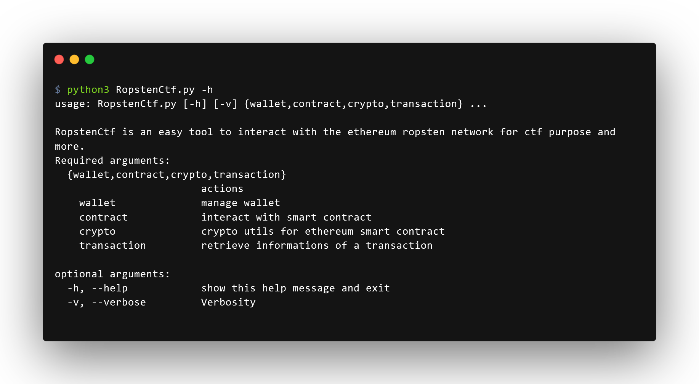
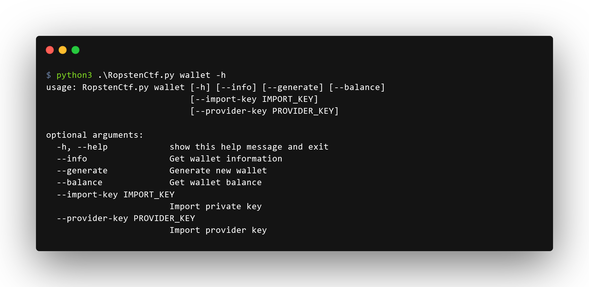
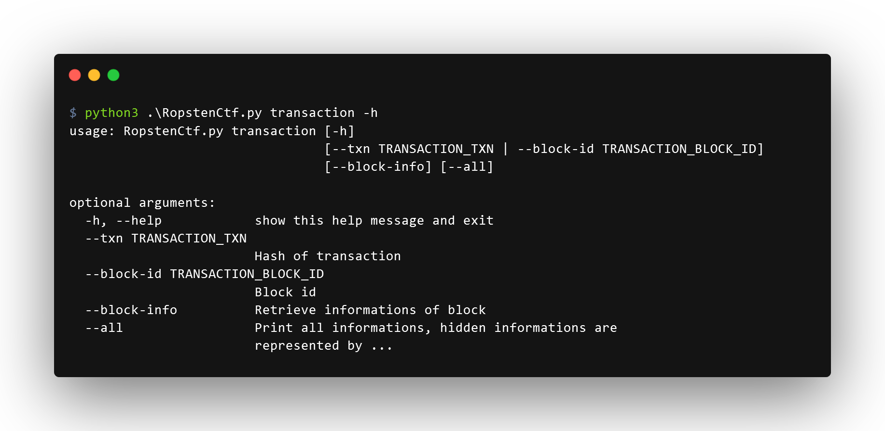
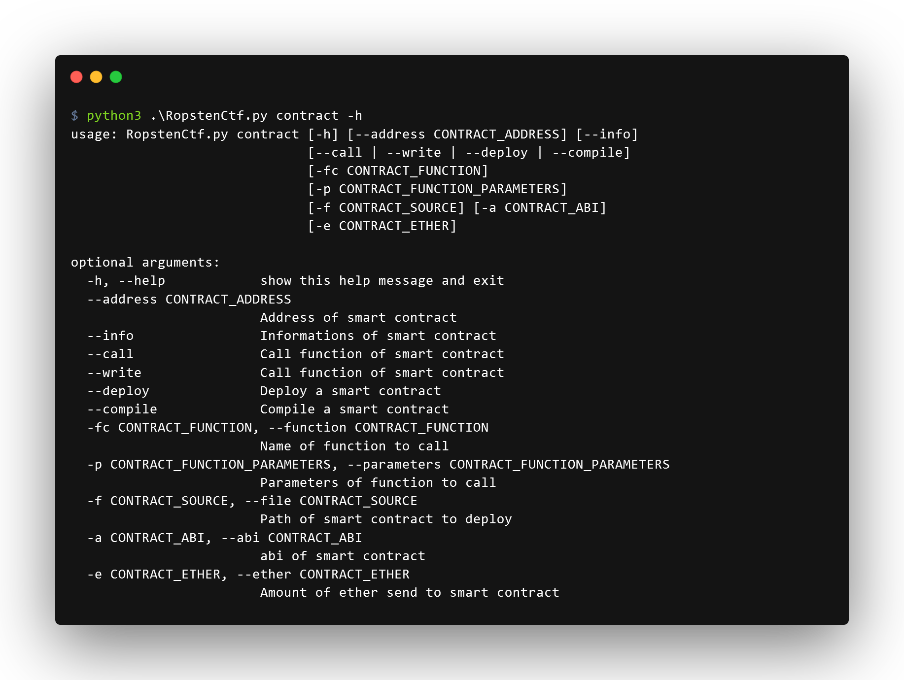

  RopstenCtf is an easy tool to interact with the ethereum ropsten network for ctf purpose and more.
   
   
  
  
  
   
  

> ⚠️**Disclaimer:** don't modify this tools for usage on ethereum blockchain or use at your own risk, I'm not responsible if you lose your cryptocurrencies. This tools is for educational purpose on **Ropsten test network** only.

# RopstenCtf  
The inspiration for this tool comes from my laziness creating more and more script to interact with blockchain during ctfs.  
I hope this project will facilitate access to web3 for everyone specialy during ctf.

I used the awesome [Capture the ether](https://capturetheether.com) platform made by [smarx](https://twitter.com/smarx) to test this tool. 

> 💡 You will need some $rETH to send transaction, claim $rETH unsing this faucet: https://faucet.egorfine.com/

**Supported features:** 
 - Ethereum wallet manager
 - Deployment and compilation of smart contract
 - Interaction with on chain smart contract
 - Inspection of transactions and block
 - Some Ethereum cryptography utils

## Prerequisites
### Solc *(for smart contract deployment and compilation features only)*

You need the solc binary to use somes features, follow the official documentation [here](https://solidity-fr.readthedocs.io/fr/latest/installing-solidity.html#paquets-linux) for installation. 
I highly recommand to directly download the binary from [release](https://github.com/ethereum/solidity/releases) rename it solc and add binary to the path.
> ⚠️ If you encounter issues installing solc check the troubleshooting section at the bottom of this page.

### Python dependencies
Install the python dependencies by running this commands :

    python3 -m pip install -r requirements.txt

### Infura api key
To interact with ethereum blockchain you need an api key, you can use the Infura provider to generate your key. Check the documentation [here]().

# Usage

## Wallet

### Import the provider key
Now import the project-id from infura, by running:

    ./RopstenCtf.py wallet --provider-key project-id-from-infura
### Setup your wallet
#### Generate a new wallet
    ./RopstenCtf.py wallet --generate
If you want to import the generated private key in metamask follow the documentation [here](https://metamask.zendesk.com/hc/en-us/articles/360015489331-How-to-import-an-Account#h_01G01W07NV7Q94M7P1EBD5BYM4).

#### Or import an existing wallet
If you want to import an existing wallet with private key, run the following:

    ./RopstenCtf.py wallet --import-key your-private-key

### Check information about your wallet

    ./RopstenCtf wallet --info
    [+] Connected to ropsten network
    [+] Public adress: 0x84dAAB1265344F9227fa1Df63906CEa27109F1a8
    [INFO] Checkout your public informations here:
    https://ropsten.etherscan.io/address/0x84dAAB1265344F9227fa1Df63906CEa27109F1a8
    [INFO] You can claim $rETH unsing this faucet: https://faucet.egorfine.com/
    [+] Balance: 9.994406372074854 $rETH

> 💡 Calling all these parameters at once is possible. 
## Inspecting transaction and block

### Inspecting transaction
    ./RopstenCtf.py transaction --txn 0x9c5629ad19808d0f9edf291a616196f149e5e95ad434d678ce3650f81c2dc6b2
    [+] Connected to ropsten network
    ╭───────── Transaction 0x9c5629ad19808d0f9edf291a616196f149e5e95ad434d678ce3650f81c2dc6b2 ──────────╮
    │        blockHash = HexBytes('0xa7f4ca4998002f01b54fdde12f3cf3af8e3a6cf2ca86b22708e0ff88d7813cf7') │
    │      blockNumber = 12295069                                                                       │
    │             from = '0x84dAAB1265344F9227fa1Df63906CEa27109F1a8'                                   │
    │              gas = 2000000                                                                        │
    │         gasPrice = 40000000000                                                                    │
    │             hash = HexBytes('0x9c5629ad19808d0f9edf291a616196f149e5e95ad434d678ce3650f81c2dc6b2') │
    │            input = '0xa3c8e393'                                                                   │
    │            nonce = 1                                                                              │
    │                r = HexBytes('0x44edf6088964fb5987fa08349a335335530ddab70740a4951ed579d824f301fc') │
    │                s = HexBytes('0x09b6fa6b7142068c7e2e3651a1ec1bbc6b957b41f78ede8814a42bc2e4824250') │
    │               to = '0x19EF59B45a65ab0850cFCB17a66478d80C319fc6'                                   │
    │ transactionIndex = 2                                                                              │
    │             type = '0x0'                                                                          │
    │                v = 41                                                                             │
    │            value = 0                                                                              │
    ╰───────────────────────────────────────────────────────────────────────────────────────────────────╯
### Inspecting block
#### with block number
    ./RopstenCtf.py transaction --block-id 12295069
    [+] Connected to ropsten network
    ╭─────────────────────────────────────────────────── Block 12295069 ───────────────────────────────────────────────────╮
    │    baseFeePerGas = 2243528846                                                                                        │
    │       difficulty = 10178556523                                                                                       │
    │        extraData = HexBytes('0x')                                                                                    │
    │         gasLimit = 8000000                                                                                           │
    │          gasUsed = 5471822                                                                                           │
    │             hash = HexBytes('0xa7f4ca4998002f01b54fdde12f3cf3af8e3a6cf2ca86b22708e0ff88d7813cf7')                    │
    │        logsBloom = HexBytes('0x000000000000000000000800002000244002000004008800408081000008000121100000000200800004… │
    │            miner = '0x0FB988FeC207162a1a0060533fBcb7aF9aDacf52'                                                      │
    │          mixHash = HexBytes('0x0f45161cc9a365be62e058abbf9ab659557edd0538e2ceec6f4523befb3d6d1e')                    │
    │            nonce = HexBytes('0x00007a86c02ebf0a')                                                                    │
    │           number = 12295069                                                                                          │
    │       parentHash = HexBytes('0x18e646c3d8e2c69bf41b82ba81f10f57d6b639c7029b44c6c62acb349f94dea5')                    │
    │     receiptsRoot = HexBytes('0x462fa2ae6c03e6fb4e41a3b652a0ed002df0c0ea4725dccd30ff74af087791c0')                    │
    │       sha3Uncles = HexBytes('0x1dcc4de8dec75d7aab85b567b6ccd41ad312451b948a7413f0a142fd40d49347')                    │
    │             size = 20655                                                                                             │
    │        stateRoot = HexBytes('0x5221c766169d948e3f0408215edd4f1319d44903283f769c2d49c7e67f12107d')                    │
    │        timestamp = 1653418694                                                                                        │
    │  totalDifficulty = 42066043784994543                                                                                 │
    │     transactions = ['...']                                                                                           │
    │ transactionsRoot = HexBytes('0x4a45e19ef76496d3908391f7b89fecb7e88fe4c6243d0182049fbe2bb12eaa83')                    │
    │           uncles = []                                                                                                │
    ╰──────────────────────────────────────────────────────────────────────────────────────────────────────────────────────╯
> 💡 Add --all to see transactions in block information

#### with transaction hash
    ./RopstenCtf.py transaction --txn 0x9c5629ad19808d0f9edf291a616196f149e5e95ad434d678ce3650f81c2dc6b2 --block-info

## Deal with smart contract

### Interact with smart contract
#### Retrieve available function of a smart contract
    ./RopstenCtf.py contract --address 0x19EF59B45a65ab0850cFCB17a66478d80C319fc6 --info
    [+] Connected to ropsten network
    [INFO] Inspect contract at https://ropsten.etherscan.io/address/0x19EF59B45a65ab0850cFCB17a66478d80C319fc6
    [INFO] Fetching abi done
    [+] List of functions:
            [*] callme()
            [*] isComplete()
#### View smart contract return method or variable
    ./RopstenCtf.py contract --address 0x19EF59B45a65ab0850cFCB17a66478d80C319fc6 --view -fc isComplete
    [+] Connected to ropsten network
    [INFO] Inspect contract at https://ropsten.etherscan.io/address/0x19EF59B45a65ab0850cFCB17a66478d80C319fc6
    [INFO] Fetching abi done
    [INFO] Calling function done
    [+] Reponse isComplete(): False

#### Call smart contract function

This action send a transaction to the network.

    ./RopstenCtf.py contract --address 0x19EF59B45a65ab0850cFCB17a66478d80C319fc6 --call -fc callme
    [+] Connected to ropsten network
    [INFO] Inspect contract at https://ropsten.etherscan.io/address/0x19EF59B45a65ab0850cFCB17a66478d80C319fc6
    [INFO] Fetching abi done
    [INFO] Inspect transaction here:
    https://ropsten.etherscan.io/tx/0x9c5629ad19808d0f9edf291a616196f149e5e95ad434d678ce3650f81c2dc6b2
    [INFO] Transaction done
    [+] Reponse callme():
            [*] Transaction status: success

> ⚠️This action can take times and will timeout after 120s, you can still see the transaction status on [ropsten etherscan](https://ropsten.etherscan.io).
>If the timeout persist, try to increase the gas price with --gas-price (default is 4000 gwei).

#### Call smart contract function with parameters
    ./RopstenCtf.py contract --address 0x7F5d37E8645d4A8C1CD08ea712C0508e8470F9BF --call -fc guess -p 42 --ether 1
    [+] Connected to ropsten network
    [INFO] Inspect contract at https://ropsten.etherscan.io/address/0x7F5d37E8645d4A8C1CD08ea712C0508e8470F9BF
    [INFO] Fetching abi done
    [INFO] Inspect transaction here:
    https://ropsten.etherscan.io/tx/0xfa778b121d7f3881159eef6812a3c240979543c063dc3b0310019295bfdb2fa7
    [INFO] Transaction done
    [+] Reponse guess(42):
            [*] Transaction status: success

> 💡 Multiple parameters is supported, usage: **-p parameter1,parameter2,...**  
> No need to worry about parameters types.

>⚠️Notice the **-e/--ether** that send 1 $rETH, this parameter is optional it depends on the smart contract.

### Compiling, deploying smart contract
>⚠️The solc binary is needed for these features.
#### Compiling smart_contract.sol
    ./RopstenCtf.py contract --compile -f NickName.sol
    [+] Connected to ropsten network
    --> NickName.sol
    
    [+] abi and bin files generated on directory:
            [*] ./NickName/CaptureTheEther.abi
            [*] ./NickName/CaptureTheEther.bin

#### Deploying contract:
    ./RopstenCtf.py contract --deploy -f NickName.sol
    [+] Connected to ropsten network
    --> NickName.sol
    
    [+] abi and bin files generated on directory:
            [*] ./NickName/NickName.abi
            [*] ./NickName/NickName.bin
    [INFO] Inspect transaction here: https://ropsten.etherscan.io/tx/0xea3a3349d7284e7a7bd2dbc94ebcc20a7ffac6b96f3726251b369744ddc8c16c
    [INFO] Transaction done
    [+] Reponse deploying contract NickName:
            [*] Transaction status: success
>⚠️This step compile and after deploy the contract on chain.

# Troubleshouting  

#### Error: No such file or directory: 'solc'
    "FileNotFoundError: [Errno 2] No such file or directory: 'solc'"  
You need to install solc binary 

#### Error: Contract source code not verified

    ./RopstenCtf.py contract --address 0x21Ac7a18A8e04A712EcEe9f5FB9aa25Dc2f568B4 --info
    [+] Connected to ropsten network
    [INFO] Inspect contract at https://ropsten.etherscan.io/address/0x21Ac7a18A8e04A712EcEe9f5FB9aa25Dc2f568B4
    [ERROR] Contract source code not verified, try again specifying the abi file with --abi (you can compile the
    smart_contract.sol with --compile if you don't have the abi file)
If the source code is not verified, try to compile the smart_contract.sol and specified the smart_contract.abi:

    ./RopstenCtf.py contract --address 0x21Ac7a18A8e04A712EcEe9f5FB9aa25Dc2f568B4 --abi NickName/NickName.abi --info
    [+] Connected to ropsten network
    [INFO] Inspect contract at https://ropsten.etherscan.io/address/0x21Ac7a18A8e04A712EcEe9f5FB9aa25Dc2f568B4
    [+] List of functions:
            [*] nicknameOf(:address)
            [*] setNickname(nickname:bytes32)